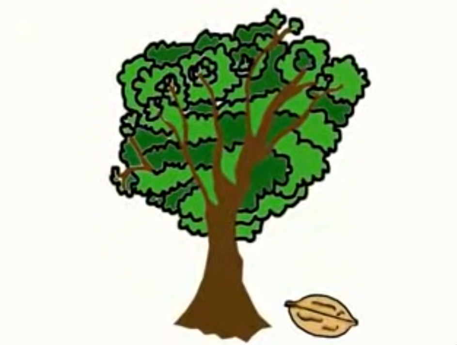

# As árveres, somos nozes



## Dependências

- **Latex**
  - Use a instalação básica do [TeX Live](https://www.tug.org/texlive/), que todas as dependências vão estar inclusas.
- **Rust**
  - Cargo
- **Haskell**
  - Cabal

## $\LaTeX$

Para compilar o documento, use o Makefile na pasta latex.

- Compila o arquivo `main.pdf` em `latex/output`.

  ```terminal
  make
  ```

- Limpa os arquivos de compilação

  ```terminal
  make clean
  ```

> Sem um readme de 100 páginas dessa vez :)

> mas se fizer errado.... ☠︎︎ ☠︎︎ ☠︎︎

---

&copy; IMD/UFRN 2024
